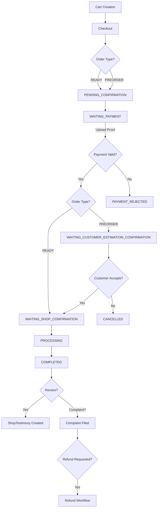

# Canteeners Admin - Project Context

## Project Overview

**Canteeners Admin** is a comprehensive food court e-commerce and management platform built with Next.js. The application serve Admin functionality for existing **Canteeners** app.

### Tech Stack

- **Framework**: Next.js 16 (App Router) with React 19
- **Language**: TypeScript 5
- **Database**: PostgreSQL with Prisma ORM 7
- **Authentication**: NextAuth v5 (beta)
- **UI Framework**: Radix UI + Tailwind CSS 4
- **Form Management**: React Hook Form + Zod validation
- **File Storage**: Vercel Blob
- **Package Manager**: Bun (lockfile present)

---

## Project Structure

```
canteeners-admin/
├── prisma/
│   ├── schema/              # Modular Prisma schema files
│   │   ├── schema.prisma    # Main configuration + Canteen models
│   │   ├── user.prisma      # User, Admin, Owner, Customer models
│   │   ├── shop.prisma      # Shop, Payment, Billing, Complaint models
│   │   ├── product.prisma   # Product, Category, Options models
│   │   ├── order.prisma     # Order, OrderItem, Refund models
│   │   ├── cart.prisma      # Cart, ShopCart, CartItem models
│   │   ├── testimony.prisma # ShopTestimony, AppTestimony models
│   │   ├── violation.prisma # CustomerViolation model
│   │   └── chat.prisma      # QuickChat model
│   ├── migrations/          # Database migrations
│   └── seed/                # Seed data files
├── src/
│   ├── app/                 # Next.js App Router
│   │   ├── api/             # API routes
│   │   ├── authenticated/   # Protected route group
│   │   │   ├── dashboard/   # Admin dashboard
│   │   │   ├── kantin/      # Canteen management
│   │   │   ├── kategori/    # Category management
│   │   │   ├── kedai/       # Shop management
│   │   │   └── users/       # User management
│   │   ├── page.tsx         # Landing page
│   │   ├── layout.tsx       # Root layout
│   │   └── globals.css      # Global styles
│   ├── components/          # Shared UI components
│   ├── features/            # Feature-based modules
│   │   ├── auth/            # Authentication
│   │   ├── canteen/         # Canteen domain
│   │   ├── categories/      # Categories domain
│   │   ├── shop/            # Shop domain
│   │   └── users/           # Users domain
│   ├── generated/           # Prisma client output
│   ├── helper/              # Utility helpers
│   ├── hooks/               # Custom React hooks
│   ├── lib/                 # Core libraries (prisma, utils)
│   └── types/               # TypeScript type definitions
├── docs/                    # Documentation
└── public/                  # Static assets
```

---

## Domain Models & Business Logic

### Core Entities

#### 1. **User System**

- **User**: Base user entity with role-based access (ADMIN | CUSTOMER | SHOP_OWNER)
- **Admin**: Extended role with management privileges
- **Customer**: End users who place orders, can be suspended for violations
- **Owner**: Shop owners managing their shop

**Key Features**:

- Role-based authentication via NextAuth
- Avatar support with default fallback
- User suspension system for customers (fraud prevention)
- Violation tracking (e.g., ORDER_CANCEL_WITHOUT_PAY)

#### 2. **Canteen & Location**

- **Canteen**: Food court location container
- **CanteenMap**: Floor-based layout with table management
- **TableQRCode**: QR codes for table identification

**Key Features**:

- Multi-floor support
- Table-based ordering via QR codes
- Shop-canteen relationships

#### 3. **Shop Management**

- **Shop**: Individual food vendors within a canteen
- **ShopBilling**: Commission-based billing records (generated by admin)
- **ShopComplaint**: Customer complaint tracking
- **Payment**: Shop payment method configurations (QRIS, Bank Transfer, Cash)

**Shop Statuses**: ACTIVE | INACTIVE | SUSPENDED
**Order Modes**: PREORDER_ONLY | READY_ONLY | BOTH
**Refund Modes**: CASH | TRANSFER

**Key Features**:

- Shop suspension capability (admin-controlled)
- Rating system (average_rating, total_ratings)
- Min/max price filtering
- Operating hours (open_time, close_time)
- Payment method flexibility with additional pricing

#### 4. **Product Catalog**

- **Product**: Food items with pricing, availability, ratings
- **Category**: Food categories with slug-based URLs
- **ProductOption**: Customization options (e.g., size, extras)
- **ProductOptionValue**: Specific option choices with additional pricing

**Option Types**: SINGLE | MULTIPLE

- SINGLE: Radio button selection (e.g., Size: Small/Medium/Large)
- MULTIPLE: Checkbox selection (e.g., Extras: Cheese, Bacon)

**Key Features**:

- Product options with conditional pricing
- Cost tracking (for profit calculation)
- Category-product many-to-many relationship

#### 5. **Shopping Cart**

- **Cart**: Customer cart container (one per customer)
- **ShopCart**: Shop-specific cart items (multi-shop ordering)
- **CartItem**: Individual product selections with options

**Cart Statuses**: ACTIVE | CHECKED_OUT | ABANDONED | EXPIRED | DELETED

**Key Features**:

- Multi-shop cart support
- Price snapshot at add time (price_at_add)
- Cart expiration mechanism
- Per-shop checkout configuration

#### 6. **Order Management**

- **Order**: Customer purchase records
- **OrderItem**: Individual items within an order
- **PaymentProof**: Upload-based payment verification

**Order Statuses**:

- PENDING_CONFIRMATION
- WAITING_PAYMENT
- WAITING_CUSTOMER_ESTIMATION_CONFIRMATION
- WAITING_SHOP_CONFIRMATION
- PROCESSING
- COMPLETED
- REJECTED
- PAYMENT_REJECTED
- CANCELLED

**Order Types**: READY | PREORDER
**Post-Order Types**: DELIVERY_TO_TABLE | TAKEAWAY | COURIER_DELIVERY

**Key Features**:

- Preorder estimation workflow
- Payment proof upload with admin approval
- Order cancellation tracking (with canceller ID)
- Real-time chat per order (conversation_id via Firebase)
- Table delivery tracking (floor, table_number)

#### 7. **Refund System**

- **Refund**: Customer refund requests linked to orders

**Refund Reasons**:

- LATE_DELIVERY
- WRONG_ORDER
- DAMAGED_FOOD
- MISSING_ITEM
- OTHER

**Refund Statuses**: PENDING | APPROVED | REJECTED | PROCESSED | CANCELLED

**Key Features**:

- Complaint proof upload
- Disbursement proof tracking
- Manual amount override
- Admin approval workflow

#### 8. **Complaint Management**

- **ShopComplaint**: Customer complaints against shops

**Complaint Statuses**: PENDING | UNDER_REVIEW | RESOLVED | REJECTED | ESCALATED

**Key Features**:

- Shop owner response system (feedback field)
- Proof of complaint evidence
- Status escalation for unresolved issues

#### 9. **Testimony System**

- **ShopTestimony**: Order-based shop reviews (1-5 rating)
- **AppTestimony**: General app feedback with role identification

**Key Features**:

- Post-order shop rating
- Landing page app testimonials

#### 10. **Communication**

- **QuickChat**: Pre-defined quick response messages for chat
- **Firebase Firestore**: Real-time chat storage (referenced by conversation_id)

---

## Feature Organization

Features follow a **domain-driven structure** with subdomain organization:

```
src/features/[domain]/
├── lib/
│   ├── [domain]-queries.ts       # Server-side data fetching
│   ├── [domain]-actions.ts       # Server-side mutations
│   ├── [domain]-types.ts         # TypeScript types/schemas
│   └── [domain]-search-params.ts # URL search param schemas (optional)
└── ui/
    └── [components]               # Domain-specific UI components
```

### Example: Shop Feature

```
src/features/shop/
├── lib/
│   ├── shop-queries.ts      # getShops()
│   ├── shop-actions.ts      # createShop(payload)
│   └── shop-types.ts        # CreateShopInput type
└── ui/
    └── [shop components]
```

### Subdomain Organization

For complex domains with multiple subdomains (e.g., shop has billing, complaints):

```
src/features/shop/
├── billing/
│   ├── lib/
│   │   ├── billing-queries.ts
│   │   └── billing-types.ts
│   └── ui/
│       └── [billing components]
├── complaint/
│   ├── lib/
│   │   ├── complaint-actions.ts
│   │   └── complaint-types.ts
│   └── ui/
│       └── [complaint components]
└── lib/
    ├── shop-queries.ts          # Core shop queries
    └── shop-actions.ts          # Core shop actions
```

---

## Naming Conventions

### Files & Directories

#### Route Segments (Indonesian)

App router paths use **Indonesian** naming for user-facing routes:

- `/authenticated/kantin` → Canteen management
- `/authenticated/kedai` → Shop management
- `/authenticated/kategori` → Category management

#### Code Files (English)

All code files use **English** with kebab-case:

- `[domain]-queries.ts` - Server-side data fetching ("use server")
- `[domain]-actions.ts` - Server-side mutations ("use server")
- `[domain]-types.ts` - Zod schemas & TypeScript types
- `[domain]-search-params.ts` - URL search parameter schemas

#### Component Files

- React components: PascalCase filenames (e.g., `ShopCard.tsx`)
- Utility modules: kebab-case (e.g., `format-currency.ts`)

### Database

#### Table Names

All Prisma models map to **lowercase plural** snake_case tables:

```prisma
model User {
  @@map("users")
}

model ShopBilling {
  @@map("shop_billings")
}
```

#### Column Names

Use **snake_case** for all database columns:

```prisma
model Order {
  payment_proof_url String?
  cancelled_reason  String?
  conversation_id   String
}
```

#### IDs

- Default strategy: `@default(uuid())` for most entities
- Exceptions:
  - `@default(cuid())` - Products
  - `@default(nanoid())` - OrderItems, CartItems, Options
  - `@default(autoincrement())` - Canteens, Categories, FAQs

#### Enums

PascalCase with SCREAMING_SNAKE_CASE values:

```prisma
enum OrderStatus {
  PENDING_CONFIRMATION
  WAITING_PAYMENT
  PROCESSING
}
```

### Code Patterns

#### Server Actions

```typescript
"use server";

export async function createShop(payload: CreateShopInput) {
  try {
    await prisma.shop.create({ data: payload });
    return { success: true };
  } catch (error) {
    console.log(error);
    return { success: false };
  }
}
```

#### Server Queries

```typescript
"use server";

export async function getShops() {
  return await prisma.shop.findMany();
}
```

#### Type Definitions

Use Zod for validation, infer TypeScript types:

```typescript
import { z } from "zod";

export const CreateShopSchema = z.object({
  name: z.string(),
  canteen_id: z.number(),
  // ...
});

export type CreateShopInput = z.infer<typeof CreateShopSchema>;
```

---

## Workflow Patterns

### 1. **Order Lifecycle**



### 2. **Refund Workflow**

1. Customer files complaint on completed/processing order
2. Customer submits refund request with:
   - Reason (DAMAGED_FOOD, LATE_DELIVERY, etc.)
   - Amount (auto-calculated or manual)
   - Proof URL
3. Admin reviews complaint + refund request
4. Admin approves/rejects refund
5. If approved, shop processes disbursement
6. Shop uploads disbursement proof
7. Refund marked as PROCESSED

### 3. **Shop Billing Cycle**

1. Admin generates billing records periodically (e.g., monthly)
2. Billing record includes:
   - `subtotal`: Total commission from orders
   - `refund`: Total refund deductions
   - `total`: Net amount owed
3. Shop owner views billing in read-only mode
4. Admin tracks payment status (PAID/UNPAID)

### 4. **Authentication Flow**

1. User logs in via NextAuth
2. Session includes role (ADMIN/CUSTOMER/SHOP_OWNER)
3. Route protection via middleware
4. Role-based UI rendering
5. Session updates for profile changes

### 5. **Payment Verification**

1. Customer places order → WAITING_PAYMENT
2. Customer uploads payment proof image(s)
3. PaymentProof record created with PENDING status
4. Admin reviews proof
5. Admin approves → Order proceeds to next status
6. Admin rejects → Order moves to PAYMENT_REJECTED

### 6. **Complaint Handling**

1. Customer files complaint on order
2. Admin/Shop owner reviews complaint details
3. Shop owner provides feedback response
4. Status updated: PENDING → UNDER_REVIEW → RESOLVED/REJECTED
5. If unresolved, escalated to admin (ESCALATED)
6. Persistent complaints tracked for shop suspension

### 7. **Multi-Shop Cart**

1. Customer adds items from Shop A → ShopCart A created
2. Customer adds items from Shop B → ShopCart B created
3. Each ShopCart has independent:
   - Payment method
   - Post-order type (delivery/takeaway)
   - Notes
4. Checkout creates separate orders per shop

---

## Key Features Summary

### Admin Capabilities

- Canteen & map management with QR code generation
- Category management (CRUD)
- Shop management (create, suspend, billing)
- User management (view, suspend customers)
- Order oversight (payment approval, refunds)
- Complaint resolution & escalation
- Violation tracking

### Shop Owner Capabilities

- Product catalog management (CRUD)
- Product options & pricing
- Payment method configuration
- Order processing & status updates
- Preorder estimation
- Chat with customers (Firebase)
- Refund request review
- Complaint response
- Billing record viewing (read-only)

### Customer Capabilities

- Browse shops by canteen/category/price
- Multi-shop cart management
- Order placement (ready/preorder)
- Payment proof upload
- Real-time order tracking
- Chat with shop owners
- Complaint filing
- Refund requests
- Shop & app testimonies
- Table-based QR code ordering

---

## Important Configuration Notes

### Prisma

- Client output: `src/generated/prisma`
- Schema split across multiple files in `prisma/schema/`
- Uses Prisma Accelerate extension

### Environment Variables

Key variables (check `.env` for actual values):

- Database connection string
- NextAuth secret & URL
- Vercel Blob token (file uploads)
- Firebase config (for Firestore chat)

### File Uploads

- Service: Vercel Blob
- API endpoint: `/api/upload`
- Usage: Product images, avatars, payment proofs, QR codes

### Chat System

- Real-time messaging via Firebase Firestore
- Order-linked conversations (`conversation_id`)
- QuickChat templates for rapid responses
- Typing indicators supported

---

## Development Guidelines

### When Creating New Features

1. **Determine Domain**: Identify the business domain (e.g., `shop`, `order`)
2. **Create Feature Structure**:

   ```
   src/features/[domain]/
   ├── lib/
   │   ├── [domain]-queries.ts
   │   ├── [domain]-actions.ts
   │   └── [domain]-types.ts
   └── ui/
       └── [components].tsx
   ```

3. **Define Schema First**: Create Zod schemas in `*-types.ts`
4. **Implement Server Logic**: Queries (read) and actions (write) in separate files
5. **Build UI Components**: Domain-specific components in `ui/`
6. **Create Routes**: Add pages in `src/app/authenticated/[route-name]`

### When Modifying Database

1. Update relevant schema file in `prisma/schema/`
2. Run migrations: `npx prisma migrate dev`
3. Update affected queries/actions
4. Regenerate Prisma client if needed

### When Adding Enums

1. Define in appropriate schema file
2. Use SCREAMING_SNAKE_CASE for values
3. Update TypeScript types if needed
4. Consider UI select components for enum selection

### Code Quality

- All mutations must use server actions (`"use server"`)
- Validate inputs with Zod schemas
- Handle errors gracefully with try-catch
- Return success/error objects from actions
- Use TypeScript strict mode
- Index frequently queried fields in Prisma

---

## Common Patterns

### Search Parameters

For list pages with filters:

```typescript
// features/shop/lib/shop-search-params.ts
export const shopSearchParamsSchema = z.object({
  status: z.enum(["ACTIVE", "INACTIVE", "SUSPENDED"]).optional(),
  canteen_id: z.coerce.number().optional(),
  page: z.coerce.number().default(1),
});
```

### Form Handling

```typescript
import { useForm } from "react-hook-form";
import { zodResolver } from "@hookform/resolvers/zod";

const form = useForm({
  resolver: zodResolver(CreateShopSchema),
});
```

### Price Calculations

- Store prices as Float (not Decimal)
- Calculate subtotals: `quantity × (price_at_add + sum(option_prices))`
- Billing: `total = subtotal - refund`

### Status Transitions

Always validate state transitions:

- Orders: Define allowed status progressions
- Refunds: PENDING → APPROVED → PROCESSED
- Complaints: Linear status flow with escalation

---

## Related Projects

This is the **admin/management portal**. There is a separate customer-facing application (likely mobile or web) that interacts with the same database for:

- Customer ordering
- Real-time chat
- Payment submissions
- Order tracking

---

## Additional Resources

- Database schema: `prisma/schema/*.prisma`
- API routes: `src/app/api/`
- Shared components: `src/components/`
- Type definitions: `src/types/`

For LLM context: This document provides a comprehensive overview of the Canteeners Admin platform's architecture, business logic, and development conventions. Use this as a reference when generating code, suggesting features, or understanding the system's design philosophy.
